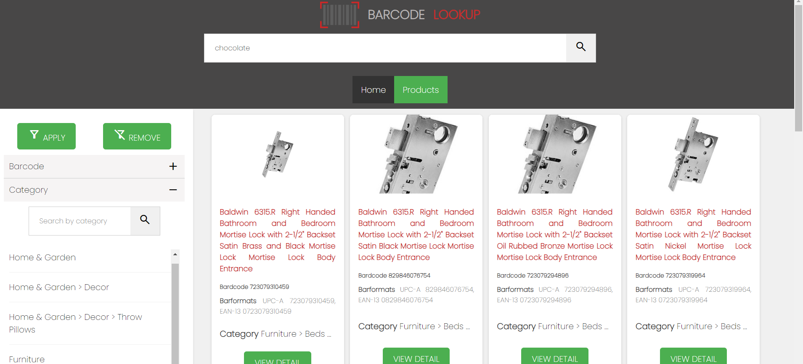

# BarcodeProductFinder



# Índice

- [BarcodeProductFinder](#barcodeproductfinder)
- [Índice](#índice)
- [Author](#author)
- [Link hosting Vercel](#link-hosting-vercel)
  - [https://barcode-product-finder-9oy59eqb8-lordherald28.vercel.app/#/product-finder](#httpsbarcode-product-finder-9oy59eqb8-lordherald28vercelappproduct-finder)
- [Docker](#docker)
  - [docker build -t docker-angular .](#docker-build--t-docker-angular-)
  - [docker run --rm -p 3000:4200 docker-angular](#docker-run---rm--p-30004200-docker-angular)
  - [Image Docker Hub](#image-docker-hub)
  - [Development server](#development-server)
  - [Code scaffolding](#code-scaffolding)
  - [Build](#build)
  - [Running unit tests](#running-unit-tests)
  - [Running end-to-end tests](#running-end-to-end-tests)
  - [Further help](#further-help)

...

# Author

**Gerardo Luis Cardenas**

- Rol: Aspirante
- Contacto: [lordherald28@gmail.com](mailto:lordherald28@gmail.com)

This project was generated with [Angular CLI](https://github.com/angular/angular-cli) version 16.0.2.

Barcode Lookup Integration and Faceted Search Functionality in Angular
Overview
This Angular project is designed to harness the power of the Barcode Lookup API for advanced product searching capabilities. It effectively combines general search functionalities with a custom-built faceted search mechanism to overcome the inherent limitations of the API.

Key Features
General Search with search Parameter: Utilizes the Barcode Lookup API's search parameter for initial data retrieval.
Advanced Faceted Filtering: Applies local facet-based filtering on the initial search results to refine and categorize data effectively.
Technical Considerations
API Limitations: Adapts to the Barcode Lookup API's constraint of a maximum of 50 queries per call.
Search Strategy: Employs a two-stage search and filtering mechanism to optimize data relevance and retrieval efficiency.
Clean Architecture & SOLID Principles: The project adheres to clean architecture standards and SOLID principles, ensuring a modular, maintainable, and scalable codebase.
Implementation Details
Initial Data Collection: Retrieves a comprehensive set of results within the API's query limit.
Local Faceted Filtering: Conducts post-processing of results for facet-based categorization, such as brand, category.
Performance Optimization
Efficient Algorithms: Implements algorithms to minimize API calls while maximizing data relevance.
Error Handling: Robust error management to maintain stability during search operations.
Data Caching: Incorporates a caching system for interim results to reduce API load.
Incremental Updates: Supports incremental updates for large datasets to keep results current without overburdening the API.
Conclusion
This Angular project demonstrates an innovative approach to integrating general and faceted searches within the constraints of the Barcode Lookup API. By combining clean architecture and SOLID principles, it offers a highly functional, efficient, and user-friendly application.

# Link hosting Vercel

## https://barcode-product-finder-9oy59eqb8-lordherald28.vercel.app/#/product-finder

# Docker

## docker build -t docker-angular .
## docker run --rm -p 3000:4200 docker-angular

## Image Docker Hub

1. **Download Image from Docker Hub**:

   ```bash
   docker pull gerasstark/barcodeproductfinder:latest
   ```

2. **Run a Container From Image**:

   ```bash
   docker run -d -p 4200:4200 gerasstark/barcodeproductfinder:latest
   ```

3. **Image Repository**:
   
    ```
    `https://hub.docker.com/repository/docker/gerastark/docker-angular/general`
    ```
    With this command, they create a container based on the image you uploaded. The port 4200 inside 
    the container is mapped to port 4200 on your local machine so you can access the application through a web browser.  

## Development server

Run `ng serve` for a dev server. Navigate to `http://localhost:4200/`. The application will automatically reload if you change any of the source files.

## Code scaffolding

Run `ng generate component component-name` to generate a new component. You can also use `ng generate directive|pipe|service|class|guard|interface|enum|module`.

## Build

Run `ng build` to build the project. The build artifacts will be stored in the `dist/` directory.

## Running unit tests

Run `ng test` to execute the unit tests via [Karma](https://karma-runner.github.io).

## Running end-to-end tests

Run `ng e2e` to execute the end-to-end tests via a platform of your choice. To use this command, you need to first add a package that implements end-to-end testing capabilities.

## Further help

To get more help on the Angular CLI use `ng help` or go check out the [Angular CLI Overview and Command Reference](https://angular.io/cli) page.
